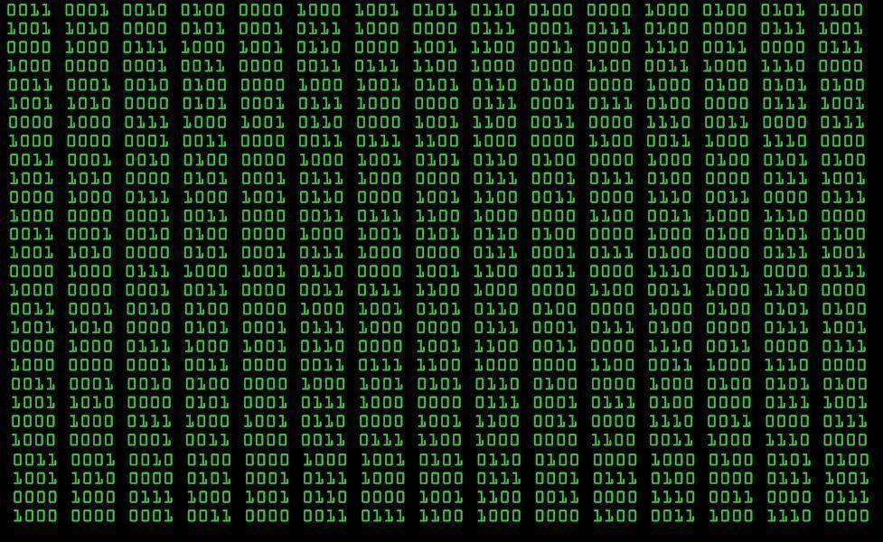
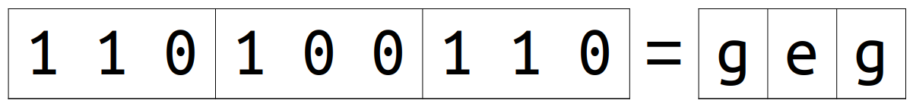

# Introduction

What types of information do computers store?

## Numbers

<iframe src="http://www.usalivestats.com" style="width: 100%; height: 500px;border: none;"></iframe>

## Text

<iframe src="https://en.wikipedia.org/wiki/Computer_architecture" style="width: 100%; height: 500px; border: none;"></iframe>

## Images

## Video

<iframe width="100%" height="500px" src="https://www.youtube.com/embed/6dkiqJ_IZGw?si=igs_Y5mGm4UrIgsX" title="YouTube video player" frameborder="0" allow="accelerometer; autoplay; clipboard-write; encrypted-media; gyroscope; picture-in-picture; web-share" allowfullscreen></iframe>

## Sound

<audio controls loop>
<source src="./media/sound.mp3" type="audio/mpeg">
</audio>

## Zeroes and ones

Everything is stored as a sequence of *zeroes and ones*.

# Binary code

System for representing information using only two symbols:

0,1

Be aware that 0 and 1 are only names for those two symbols we&rsquo;ll use to represent information. Those names have nothing to do with their real physical representation inside the computer&rsquo;s memory.

# Natural numbers

Natural numbers are the numbers we use for counting: 0, 1, 2, 3,&#x2026;

Technically speaking, 0 is not a natural number, but we&rsquo;ll consider it natural here, for simplicity.

The representation of natural numbers will be the basis for the representation of other types of information.

## Digits and sequences

-   **Sequence**: `1234`
-   **Digit**: each symbol in a sequence.

We have only 10 different symbols: 0, 1, 2,&#x2026; 9.

Count passed 9&#x2026; we ran out of symbols&#x2026; we add a digit.

Count passed 99&#x2026; we ran out of symbols&#x2026; we add a digit.

We use sequences of symbols: this way, we can represent infinite things with a limited amount of symbols.

Natural numbers are the numbers we use to count: 0, 1, 2, 3, 4,&#x2026;

We only have ten different symbol for representing these numbers: 0, 1, 2,&#x2026;, 9.

To represent bigger quantities, we use sequences of these symbols, like 1234. Each symbol in a sequence is called a digit.

Combining the symbols into sequences allows us to represent infinite numbers, as long as the length of the sequence is unlimited. For example, with 3-digit sequences we can write 10x10x10=1,000 different numbers, which are: 0, 1, 2,&#x2026; 999 (we don&rsquo;t usually write the leading zeroes: 000, 001, 002,&#x2026;).

## Counting with only two symbols

0

1

10

11

100

101

110

111

The system we use with two symbols is the same: build sequences. Even with only two symbols, there are 4 different 2-digit sequences, 8 different 3 digit-sequences, etc.

## Position values: decimal numbers

<h2 style="font-size: 5em; font-family: Courier">2 2 2 2</h2>

The value of a digit depends on its position in the sequence.

<ul class="org-ul">
<li>the value of the right-most 2 is 2 (2 times 1);</li>
<li>the value of the next 2 is 20 (2 times 10);</li>
<li>the value of the third 2 is 200 (2 times 10 times 10);</li>
<li>the value of the left-most 2 is 2000 (2 times 10 to the third).</li>
</ul>

Every time we shift one position to the left, we multiply the value by ten. This is due to the fact that when we add a digit, the number of different combinations is multiplied by 10, because there are 10 different symbols.

## Position values: binary numbers

<h2 style="font-size: 5em; font-family:Courier">1 1 1 1</h2>

The system is the same as with decimal numbers. There are two differences:

<ul class="org-ul">
<li>we only have <code>0</code> and <code>1</code>: the value of a digit is either zero, or the value of its position;</li>
<li>every time we shift one position to the left, we multiply the value by two (because, the number of different combinations is increased by a factor of two).</li>
</ul>

## `Binary` ➡️ decimal

| 128 || 64 || 32 || 16 || 8 || 4 || 2 || 1 |
| 1 || 0 || 1 || 1 || 0 || 1 || 0 || 1 |
|  ||  ||  ||  ||  ||  ||  ||  |

128 + 32 + 16 + 4 + 1 = 181

We don&rsquo;t have to take into account the zeroes, because their value is zero!

## 📝 Exercise

<code>1 1 0 1 1 1 0 0</code>

128 + 64 + 16 + 8 + 4 = 220

## 📝 Exercise

<code>0 0 0 1 0 1 1 1</code>

16 + 4 + 2 + 1 = 23

## 📝 Exercise

Which is the biggest 8-digit binary number?

The biggest 8-bit binary number is:

1111 1111

Whose value is:

128 + 64 + 32 + 16 + 8 + 4 + 2 + 1 = 255

It&rsquo;s the immediately preceding number to:

0001 0000 0000

Whose value is: 256 (2^8)

## Decimal ➡️ `binary` (subtract method)

Code in binary the number: 221

<ol class="org-ol">
<li>Find the biggest power of two smaller than the number.</li>
<li>Add a <code>1</code> digit to the position corresponding to that power of two.</li>
<li>Subtract that power of two from the number.</li>
<li>Repeat the process with the reminder of the subtraction, until the reminder is <code>0</code>.</li>
</ol>

221 - 128 = 93

93 - 64 = 29

29 - 16 = 13

13 - 8 = 5

5 - 4 = 1

1 - 1 = 0

221 = 128 + 64 + 16 + 8 + 4 + 1

221 = 1 1 0 1 1 1 0 1

## 📝 Exercise

Code in binary the number: 118

118 - 64 = 54

54 - 32 = 22

22 - 16 = 6

6 - 4 = 2

2 - 2 = 0

118 = 64 + 32 + 16 + 4 + 2

118 = 0 1 1 1 0 1 1 0

## Decimal ➡️ `binary` (division method)

Code in binary the number 221 using the division method.

<ol class="org-ol">
<li>Divide the number by 2.</li>
<li>Write down the reminder.</li>
<li>Replace the number by the quotient, and repeat the process until the quotient is <code>0</code>.</li>
<li>📝 Write all the reminders in reverse order.</li>
</ol>

221 / 2 = 110 r: 1

110 / 2 = 55 r: 0

55 / 2 = 27 r: 1

27 / 2 = 13 r: 1

13 / 2 = 6 r: 1

6 / 2 = 3 r: 0

3 / 2 = 1 r: 1

1 / 2 = 0 r: 1

221 = 1 1 0 1 1 1 0 1

## 📝 Exercise

Code in binary the number: 118

118 / 2 = 59 r: 0

59 / 2 = 29 r: 1

29 / 2 = 14 r: 1

14 / 2 = 7 r: 0

7 / 2 = 3 r: 1

3 / 2 = 1 r: 1

1/ 2 = 0 r: 1

118 = 1 1 1 0 1 1 0

# Information units

-   1 bit = 1 binary digit
-   1 byte = 8 bits
-   1 Kilobyte (1 Kb) = $2^{10}$ bytes = 1,024 b &asymp; 1,000 b
-   1 Megabyte (1 Mb) = $2^{10}$ Kb &asymp; 1 million bytes
-   1 Gigabyte (1 Gb) = $2^{10}$ Mb &asymp; 1 billion bytes
-   1 Terabyte (1 Tb) = $2^{10}$ Gb &asymp; 1 trillion bytes

## Storage size

-   *El Quijote*: 2,034,611 characters (&asymp; 2 Mb).
-   Picture of 1MP in JPG: approx. 0.5Mb.
-   Video HD 60FPS: 200Mb/minute.

# Texts

## Characters

-   **Character**: symbols that make up the written text.
-   **Text**: a sequence of characters.

## Text binary code

a = `0`; b = `1`; c = `10`; d = `11`; e = `100`; f = `101`; g = `110`

Code: `110100110`

Meaning?

Where does each character start and end?

## Fixed-length code

a = `000`; b = `001`; c = `010`; d = `011`;

e = `100`; f = `101`; g = `110`

Code: `110100110`

Meaning?

Problem: waste of bits.

Optimal solution. <i>Huffman codes</i> (don&rsquo;t repeat the start).
a = 00; b = 01; c = 100; d = 101; e = 1100; f = 1101; g = 1110

1000011101100

## ASCII

ASCII stands for American Standard Code for Information Interchange

The table shown is quite old. It&rsquo;s still in use in some applications, but it has mostly been replaced by other coding systems, especially by Unicode.

Most of the first 32 codes are not really characters, but codes used by the computer to communicate with the screen while sending the actual characters to be printed on it.

The length is fixed: 8 bits.

## Example

`Hello, world!`

`72 101 108 108 111 44 32 119 111 114 108 100 33`

`01001000 01100101 01101100 01101100 01101111 00101100 00100000 01110111 01101111 01110010 01101100 01100100 00100001`

Remember that the length is fixed: if the number is smaller than 128, you should put some leading zeroes.

## 📝 Exercise

Code in 8-bit ASCII: `IPv4`

073 080 118 052

01001001 01010000 01110110 00110100

# Images

## Bitmap images (raster graphics)

Image is made up of small squares of a specific color, called pixels.

When I zoom in, I see the pixels.

Good for photographs (real images).

## Vector graphics

Images are made up of geometric shapes.

I can zoom in as much as I want. Will never lose detail.

God for drawings and text.

## Bitmap images

Pixel = Picture element

Pixel size = width (px) x height (px)

## Color

RGB = Red Green Blue

1 byte per color = 3 bytes per pixel

Example: `11111111 11111111 00000000` = yellow (red + green)

## Color depth

**Color depth** = number of bits per pixel

RGB = 24 bits/px

📝 How many different colors can be represented?

📝 How much memory occupies a 800x600 px image?

How many different colors can be represented this way?

256 x 256 x 256 = 2^24 = 16 x 2^20 = 16,000,000 (aprox)

📝 How much memory occupies a 800x600 px image?

800 x 600 = 480,000 px

480,000 x 3 = 1,440,000 bytes = 1.34 Mb

But there&rsquo;s compression.

## Color Picker

<input type="color">

## Transparency

**Alpha Channel**: 1 byte for opacity.

**RGBA** = RGB + Alpha Channel

4 bytes per pixel

**JPG** ❌ no alpha channel

**PNG** ❔ optional alpha channel
